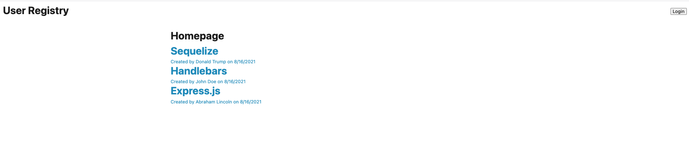
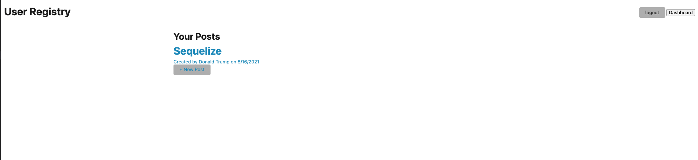

# Homework-14-Tech-Blog

## Description

This is my homework-14 about Tech-Blog using CMS style blog site similar to a Wordpress site, where developers can publish their blog posts and comment on other developers' posts as well. This app will follow the MVC paradigm in its architectural structure, using Handlebars.js as the templating language,

# Installation

1. Please type in "npm i"  
2. Install database by running "npm run seed.
3. Run the code by typing "node server.js"
4. Seed the database by typing "mysql -uroot < db/schema.sql

# Usage

Please follow the directions from README file.

# Contributing

Please follow the directions from README file.

# Tests

Please follow the directions from README file.

# Questions

Need to contact [jung0808?](https://github.com/jung0808)  
[You can contact me here - Email](mailto:j.nam0808@gmail.com)

# Screenshot of Project

 

## https://github.com/jung0808/homework-14-tech-blog

## https://desolate-brook-59192.herokuapp.com/
